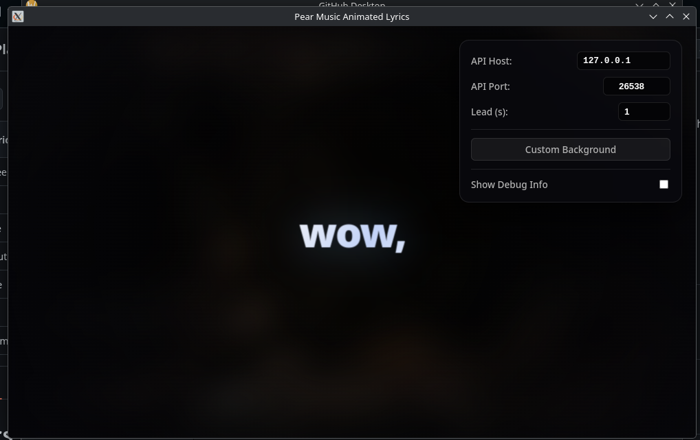
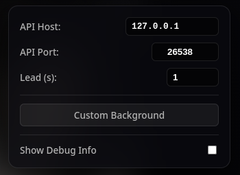

[](https://www.electron.org/)
[](https://www.kernel.org/)
[](https://adoptium.net/)
[](https://adoptium.net/)
[](https://archlinux.org/)
[](https://www.debian.org/)
[](https://getfedora.org/)
[](https://www.gentoo.org/)
[](https://www.opensuse.org/)

---

# Lyrics Player GUI

A desktop lyrics overlay for [Pear Music Desktop](https://github.com/pear-devs/pear-desktop). ~~It connects to Pear’s local API~~, shows synced lyrics in time with playback, and ~~falls back~~ fetch the lyrics form [LRCLIB](https://lrclib.net) ~~when Pear does not provide lyrics~~ Yeah this just never worked.

Built with **Electron** — a frameless-friendly window with a blurred album-art background and word-by-word line animations.

## Screenshots

| Main view | Controls |
| --- | --- |
|  |  |
| Synced lyrics over blurred cover art | API host, port, sync lead, background, debug |

## Features

- **Pear API integration** — WebSocket (`/api/v1/ws`) plus HTTP polling (`/api/v1/song`) for track metadata and playback position
- **Synced lyrics** — Line-by-line display with adjustable lead time (lyrics appear slightly before the beat)
- **Word-by-word animation** — Each line reveals one word at a time based on time until the next line
- **LRCLIB fallback** — Fetches synced LRC lyrics when Pear has no lyric payload
- **Local caching** — Lyrics and album art cached in `localStorage` for faster track changes
- **Custom background** — Optional image upload instead of the current track’s cover
- **Debug panel** — Optional raw JSON view of the Pear player state
- **Minimal UI** — Press **Space** to hide or show the controls panel

## Requirements

- [Node.js](https://nodejs.org/) (LTS recommended)
- Pear Music Desktop running with its API Server enabled (default port **26538**)

## Installation

```bash
git clone https://github.com/YOUR_USERNAME/Lirycs-Player-GUI.git
cd "Lirycs Player GUI"
cd src
npm install
```

## Usage

1. Start Pear Music Desktop and begin playback.
2. Start the API Server on the app and set no verification (the app is not able to ask permition).
3. Run the overlay:

   ```bash
   npm start
   ```

4. In the controls panel (top right), set **API Host** (usually `127.0.0.1`) and **API Port** (default `26538`).
5. Adjust **Lead (s)** if lyrics feel early or late relative to the audio.
6. Press **Space** to toggle the controls panel for a clean fullscreen lyrics view.

## Configuration

| Setting | Description |
| --- | --- |
| API Host | Pear API hostname (stored in browser `localStorage`) |
| API Port | Pear API port (default `26538`) |
| Lead (s) | Timing offset in seconds; positive values show lyrics earlier |
| Custom Background | Local image instead of the current track artwork |
| Show Debug Info | Live JSON payload from Pear |

## Package for Windows

```bash
npm run package
```

Output is written to `dist/` as a packaged Windows (`win32` x64) app named **PearLyrics**.

## Project structure

```
src/
├── main.js       # Electron main process
├── index.html    # UI shell
├── app.js        # Pear API, lyrics sync, LRCLIB fallback
├── style.css     # Glassmorphism UI and lyric animations
└── package.json
```

## License

See [LICENSE](LICENSE).
